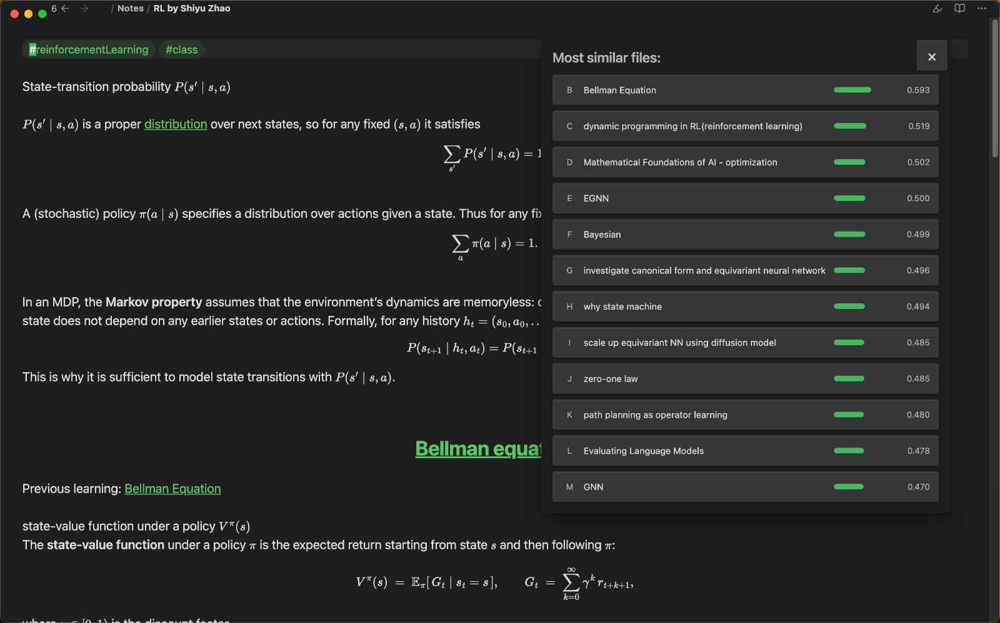

# Embedding (Obsidian plugin)

Semantic, keyboard-first navigation for your vault. This plugin builds embeddings for your notes and opens a floating pop-out panel so you can jump through related ideas without touching the sidebar.

Currently supports OpenAI embeddings via an OpenAI API key.

## What it feels like
- Open the pop-out and stay on the keyboard.
- `a` always opens the original note.
- `b`/`c`/`d`… open ranked similar notes.
- `z` recomputes using the currently open note as the new “original”.
- Hotkeys are captured while the panel is open, so focus changes do not break navigation.

## Features
- Floating similarity panel (ESC closes it)
- Single-letter navigation with deterministic hotkeys
- Batch embedding updates for all notes
- Optional auto-update on startup (same logic as manual update)
- Configurable model, dimensions, and API base URL

## MCP status
The community build does not include the MCP server (local HTTP servers are not permitted by Obsidian review). If you need MCP integration, use a private fork or a local build.

## Commands
- `See connections for current note`
- `Update all note vectors`

## Settings
- API key
- API base URL
- Model
- Dimensions
- Max input chars
- Similarity limit
- Batch size
- Auto update on startup

## Installation (manual)
1) Copy this folder to `YOUR_VAULT/.obsidian/plugins/embedding/`
2) `npm install`
3) `npm run build`
4) Enable the plugin in Obsidian

## Usage
1) Configure your API key in settings.
2) Run `Update all note vectors` once to generate `embeddings.json`.
3) Run `See connections for current note` to open the pop-out panel.

## Data
- Embeddings are stored in `embeddings.json` at the vault root.
- The file is created automatically if missing.
